# **Project Stokku**

Salah satu project yang dibuat untuk menyelesaikan course di Alterra Academy https://alterra.id

## **Overview**

- CRUD Account, Barang (Create, Read, Update, Delete)
- Login Account
- Transaksi Barang 

## **ERD PROJECT Stokku**

- ini adalah hasil ERD untuk Project Stokku ini.
  

## **Getting Started**

- Silahkan sesuaikan data di file `.env`
- Buka file `MenuUtama.go` di folder `utilities` dan hilangkan tanda `//` untuk auto_migrate pertama kali
- Lalu jalankan cmd dengan perintah `go run main.go` atau `go run .`

## **Hasil Project Stokku**

- ini adalah Menu Register.

  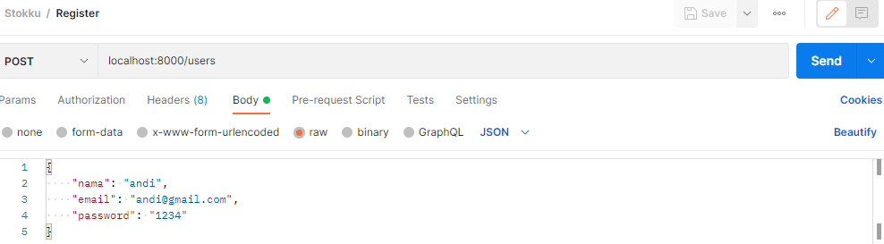
  
  - ini adalah Hasil Dari Register.

  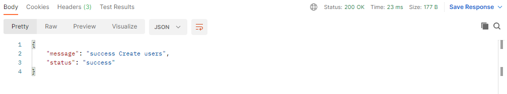

- ini adalah Menu Login.

  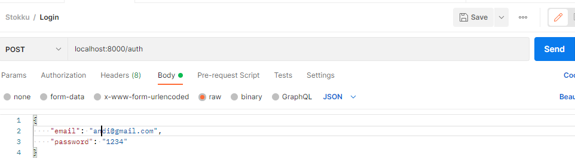
  
  - ini adalah Hasil dari Login.

  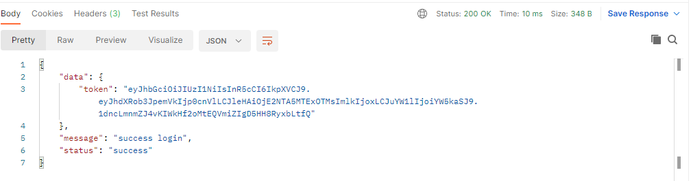

- ini adalah Menu Get User.

  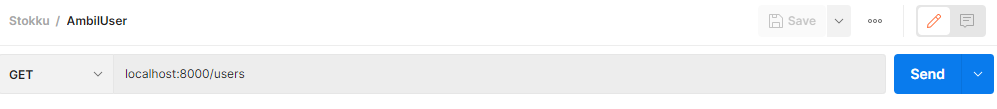
  
  - ini adalah Menu Hasil dari Get User.

  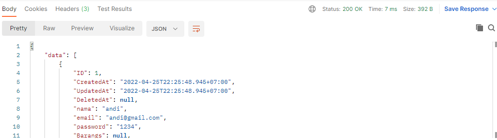

- ini adalah Menu Get User by id.

  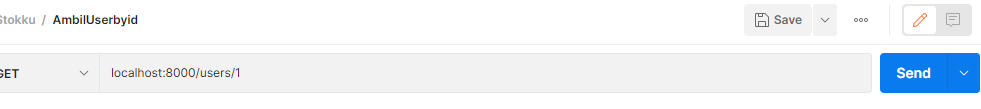
  
- ini adalah Menu Hasil dari update User.

  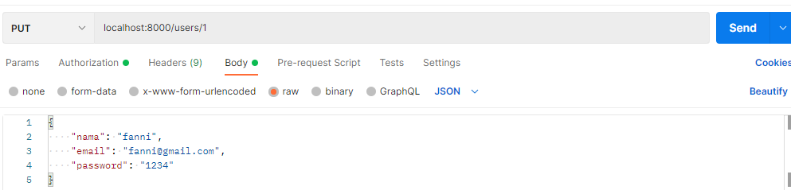
  
- ini adalah Menu Delete User.

  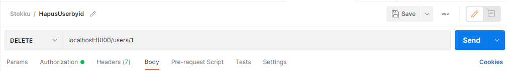

- ini adalah Menu Tambah Barang.

  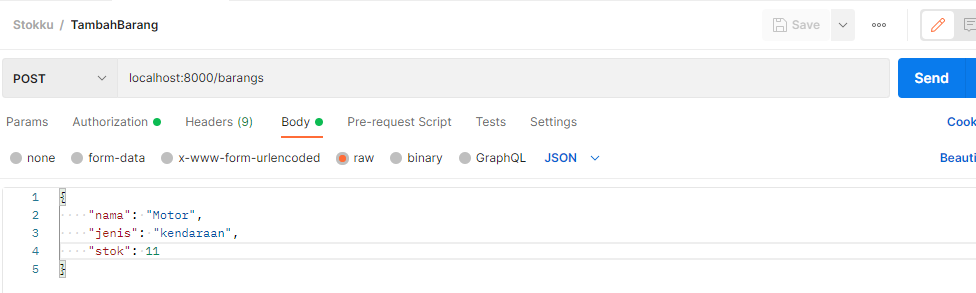
  
- ini adalah Hasil dari Tambah Barang.

  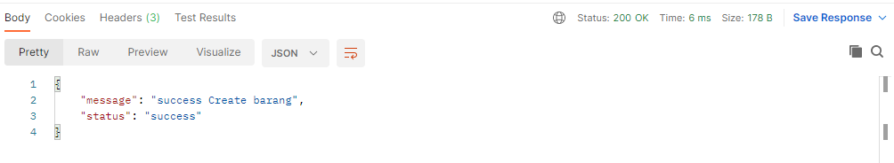

- ini adalah Menu Get Barang.

  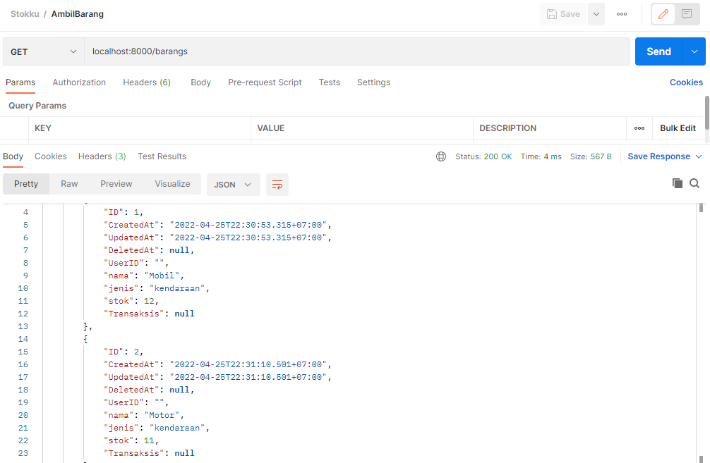
  
- ini adalah Menu Get Barang by id.

  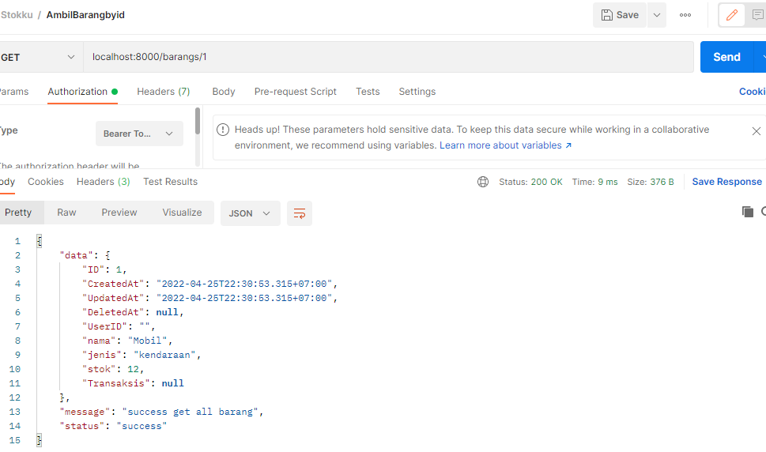

- ini adalah Menu Update Barang.

  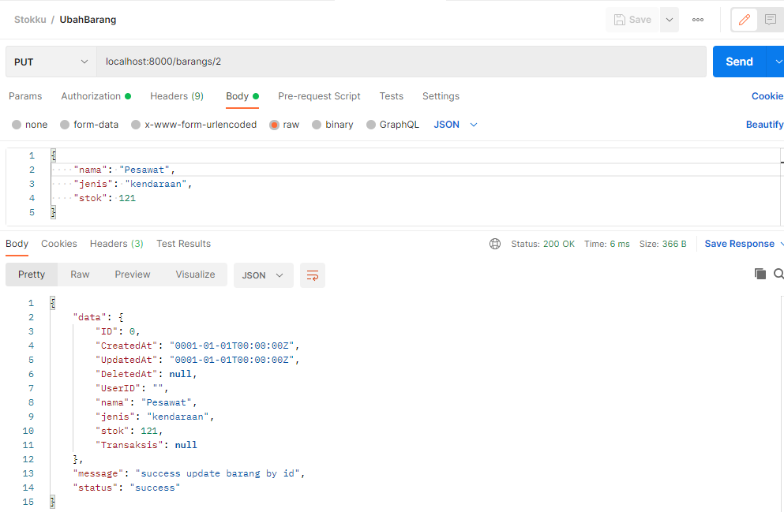

- ini adalah Menu Hapus Barang.

  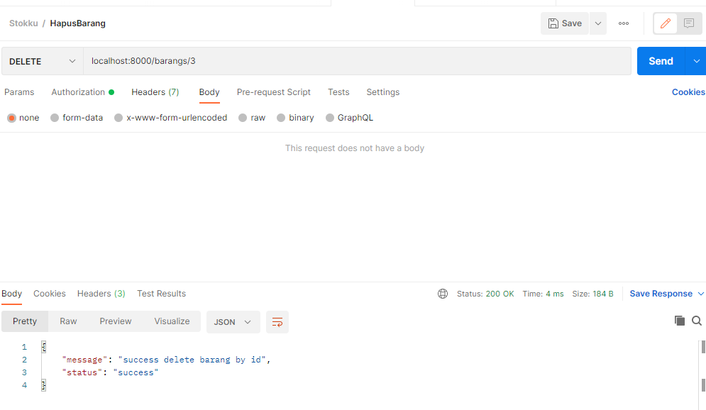

- ini adalah Menu tambah transaksi.

  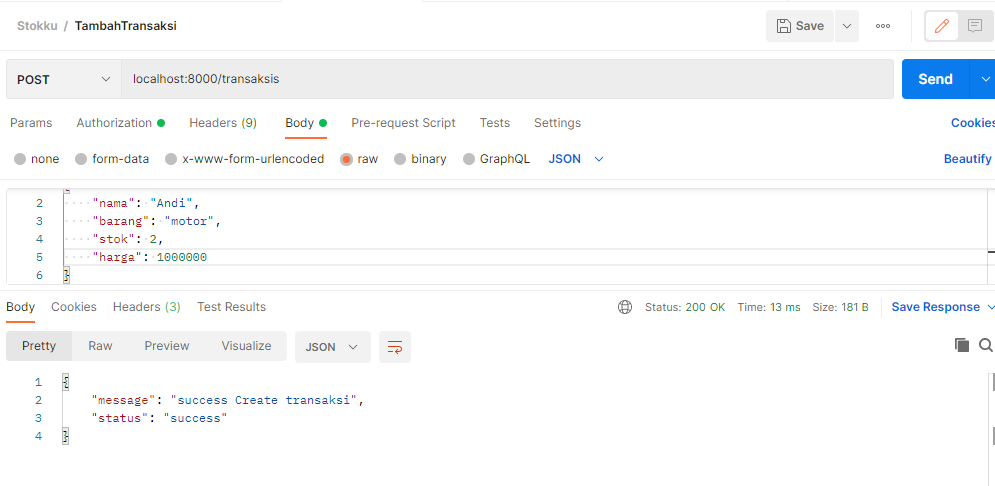

- ini adalah Menu Get Transaksi.

  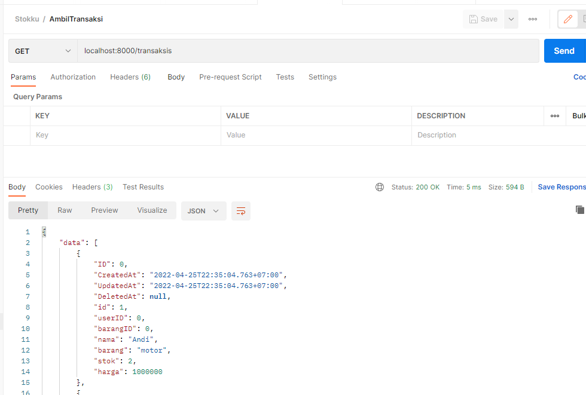
  
- ini adalah Menu Get Transaksi by id.

  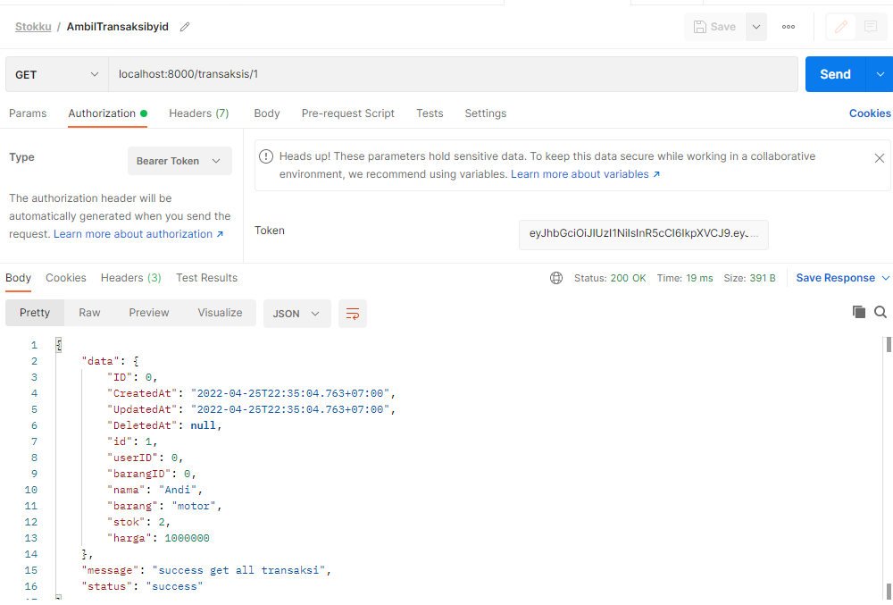

## **Tech Stack**

- Golang  https://go.dev
- Gorm.io  https://gorm.io
- Godotenv https://github.com/joho/godotenv
- viper    https://github.com/spf13/viper
- Echo     https://echo.labstack.com/
- Middleware    https://echo.labstack.com/middleware
- Jwt     https://github.com/golang-jwt/jwt

## **Contributing**

- Alka Prasetya https://github.com/alkaprasetya

## **Lisence**

© April 2022
